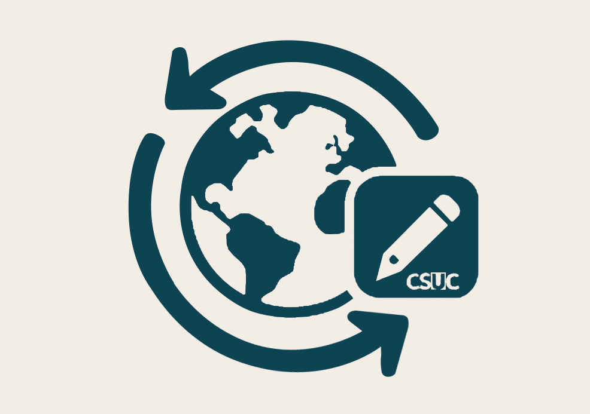

# Global Changes CloudApp

**Global Changes** is an [ExLibris Alma CloudApp](https://developers.exlibrisgroup.com/cloudapps/) designed to streamline batch updates to Alma records. This app supports operations on multiple types of records (items, holdings, users and POL.) with built-in validation.

---

## 📖 Guide Documentation

For usage instructions and screenshots, please refer to our [Guide Documentation](doc/guide.md).

---

## ⚙️ Supported Features

- **Apply global updates to:**  
  - Items  
  - Holdings  
  - Users  
  - POLines

- **File Validation & Duplicate Detection:**  
  Dynamically checks for duplicates based on headers or column indices (e.g., MMS ID, Barcode, Physical ID).

- **Exact Content Changes & Result Set Creation:**  
  Provides the option to perform changes based on exact content matches. The app can also create result sets that separate records processed successfully from those that failed, enabling efficient tracking and analysis.

- **Access Control:**  
  Role-based and user-based configuration options restrict usage.

- **Logging & Analytics:**  
  Logs process execution results (updated count, errors, total rows, elapsed time, etc.) for further reporting and statistical purposes.

---

## 🧑‍💼 Required Roles

There is no need specific roles to use this CloudApp.

---

## 🚀 How to Use

1. **Installation:**  
   Install the **Global Changes** CloudApp from the Alma App Center.

2. **Launching:**  
   From the Alma interface, open the relevant record or navigate to the CloudApp.

3. **File Upload:**  
   Upload a CSV file containing the data for batch updates. The file will be validated and duplicates detected automatically.

4. **Configuration:**  
   Set parameters for the process as required by your institution’s needs.

5. **Execution & Logging:**  
   Launch the process. Execution results are logged and statistics are sent for analysis.

---

## ⚙️ Configuration

Administrators can configure the CloudApp through the settings menu (access via the “three dots” menu and the configuration icon). Options include:

- **Access Restriction:**  
  You can restrict access to the entire CloudApp by specifying allowed users and/or roles.

- **Module Restriction:**  
  You can restrict access to specific modules by specifying allowed users and/or roles.

---

## 🔐 Access Management

Access is controlled via:
- **User Whitelist:**  
  Grant access to specific users regardless of their roles.
- **Role-based Restrictions:**  
  Restrict usage to specific roles (General System Administrator, Catalog Administrator, or User Administrator).

*Note:* The interface restrictions are UI-based. API calls require the logged-in user to have the proper permissions in Alma.

---

## 📊 Logging & Statistics

Each process execution sends statistics to a backend logger for institutional analysis. Example log entry for a file with 47 rows, 45 success and 2 errors:

item#IZ_CODE#45#2#47#00:06#09-04-2025 15:42:31

*Logged data includes:*
- Process type (e.g., `modify_item`, `remove_user`, `modify_poline`...)
- Institution code (e.g., `34CSUC_NETWORK`)
- Number of records updated and errors encountered
- Total rows in the CSV file
- Elapsed time (minutes:seconds)
- Timestamp

This information is used for monitoring performance and generating statistical reports.

---

## 📁 File Structure & Duplicate Detection

The CloudApp employs a comprehensive file validation mechanism to ensure that all uploaded CSV files adhere to the required formats. This function supports multiple file types and performs the following checks:

- **File Presence & Type:**  
  It validates that a file is provided and that it is in CSV format.

- **File Size:**  
  It ensures that the file does not exceed the maximum allowed size (e.g., 2MB). Exceeding this limit causes validation to fail.

- **Header & Column Count:**  
  It verifies that the CSV file contains the necessary header row. Depending on the process type passed as an option (e.g., `'polines'`, `'item'`, `'holding'`, or `'user'`), the function checks that the number of columns in the file matches the allowed columns.  
  - For `item` files, valid files may have either **3 columns** or **5 columns**, or variable if you are creating items in bulk. 
  - For `holding` files, a **6-column** configuration is expected.  
  - For `user` files, a **1-column** configuration is required.
  - For `po lines` files, a **3-column** configuration is required.

- **Duplicate Detection:**  
  After validating the structure, the function checks for duplicate identifiers.

If any of these checks fail, the function returns a detailed error message so the user can correct the file before processing.

---

## 📜 Background

The Global Changes Portal (GCP) project was initiated in November 2022. Originally, it aimed to provide a simple solution for modifying the topographical data (852 $$h) of holding records.

Previously, this operation was performed in Sierra using externally prepared files that were uploaded via a global changes function. With the migration to Alma (2021), that option was lost, prompting the development of a tool that would enable GEPA staff to perform these tasks autonomously.

During the development of this portal, new requirements emerged from the consortium institutions-requirements closely related to item records. The necessary changes in item records could not be made within the system, since the item modification interface only allows adding or replacing specific content across a set of records.

Leveraging Alma’s APIs and the expertise gained during development, the originally conceived portal was expanded to provide a broader service that meets the needs of various institutions linked to the CCUC Network Zone. This portal was later presented to CCUC institutions during a CSUC success program session and, a few months afterward, at the Ex-Libris User Group meeting in Spain (Expania).

---
## ℹ️ Usage Disclaimer

> **Disclaimer:**  
> This CloudApp has been developed by the **Consorci de Serveis Universitaris de Catalunya (CSUC)**. We are **not responsible** for any issues that arise from modifying Alma records. All responsibility lies solely with the user executing the processes.  
> Furthermore, anonymized data such as processed records, errors, process type, and the initiating institution code are sent for statistical purposes.
> We do not store any personal details or information belonging to users.

---

## 🧪 Development

For instructions on setting up the development environment, building, and contributing to the CloudApp, please see [doc/development.md](doc/development.md).

---

*For more details, visit the [ExLibris Developer Portal](https://developers.exlibrisgroup.com/cloudapps/).*  
