# Global Changes CloudApp Guide

This guide provides an overview of the Global Changes CloudApp, including details on configuration, navigation, and file validation.

---

## 1. Configuration

### Configuration Icon
Access the configuration settings by clicking on the configuration icon within the CloudApp. This icon opens the settings menu where you can define both global and module-specific configurations.

**Configuration Icon:**

---

### Global Configuration
The **Global Configuration** controls access to the entire CloudApp. This section allows administrators to set general access restrictions by specifying which users or roles can use the app.

**Interface:**

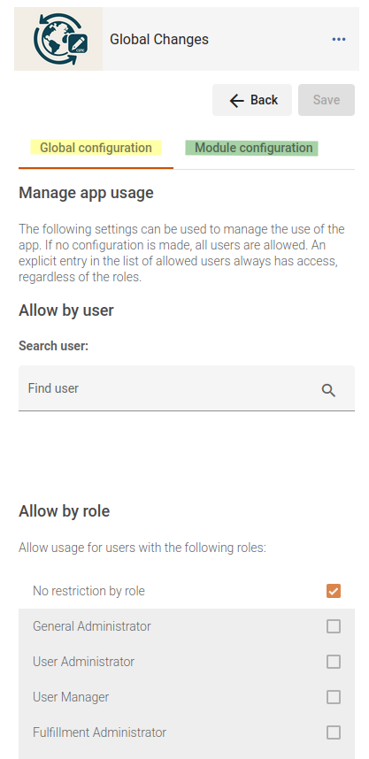

---

### Module Configuration
The **Module Configuration** lets you restrict access to specific modules or functionalities within the app. You can define access rules (by user or role) for each module separately.

**Interface:**

---

## 2. Main Application Interface

### Main Interface
Once you enter the CloudApp, you will be greeted with the main interface. This area displays the core functionalities and provides quick access to various features.

**Interface:**

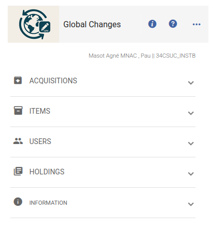

---

### Menu
The **Menu** in the main interface presents all available options. It enables easy navigation between different functionalities such as items, holdings, users, and POLines.

**Menu Interface:**

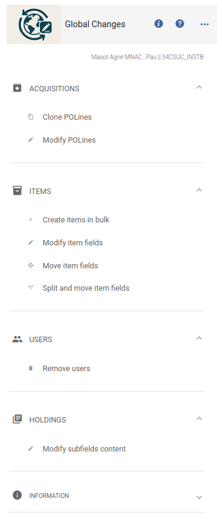

---

## 3. File Validation

### Validation
All functionalities include different validations, depending on their specific characteristics.

**Validation:**

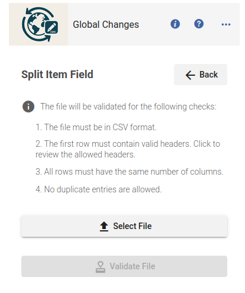

---

### Validation Error
Before launching a process, the CloudApp validates the uploaded CSV file. If the file fails validation, an error message is displayed. The image below shows an example of a validation error.

**Validation Error:**

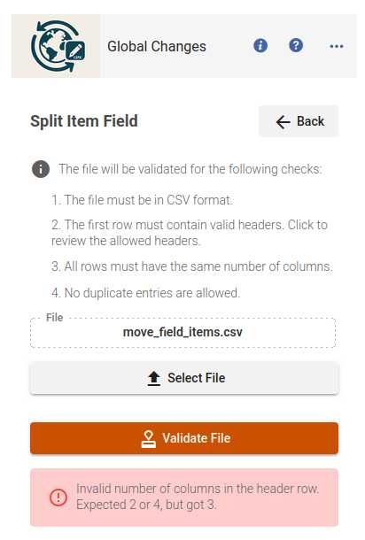

---

## 4. Functionality Demonstrations

### Form Interface
When you use any function, a dedicated form appears for entering the required data. The following image shows an example of the interface used for splitting fields.

**Example Form:**

---

### Processing Progress
During process execution, the CloudApp displays a progress bar showing the actual progress and the total number of lines being processed.

**Processing Changes:**

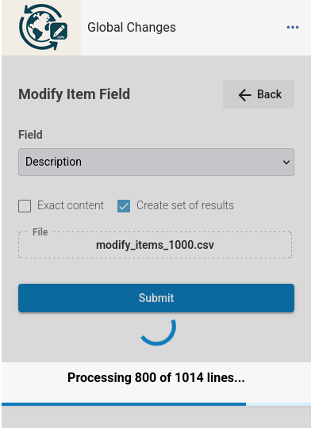

---

### Process Summary
Once the process has finished, a summary and an alert is displayed. This alert shows whether the process succeeded, partially succeeded, or failed. The summary includes details such as the time spent, the number of successful actions, errors, and the IDs of the result sets (if the option to create sets was checked).

**Process Summary:**

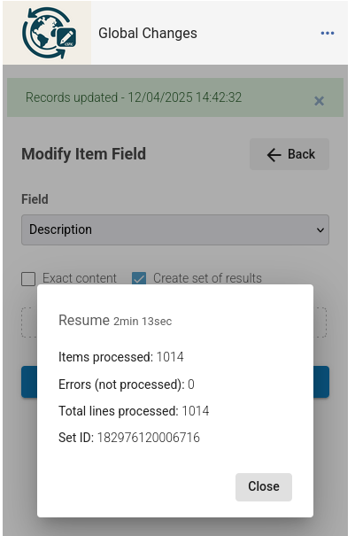

---

### Result Sets
If result sets are enabled, the CloudApp creates separate sets for successful and failed records (always that it's possible). Each set is named according to the process that was launched, clearly indicating whether it is a success or error set.

**Sets Interface:**

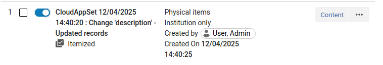

---

### Move Field Functionality (Items)
The "move field" functionality lets you reposition a field within an item record. In the example below, the app moves "internal note 3" to "public note" at the front. A delimiter (double hyphen, `--`) is used to separate the values. Note that the original text in the source field ("internal note 3") remains because the "empty origin field" checkbox is not selected.

**Move Field Example:**

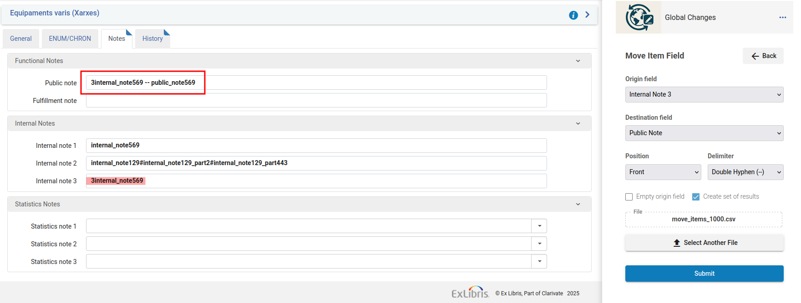

---

### Modify Field Functionality (Items)
This function allows you to update the content of a field within an item record. In the example shown, a CSV file is uploaded to update the description field from `descripcio569` to `descripció569_mod`. You have the option to mark a checkbox for changes based on exact content; if this option is not selected, the change is applied only to the portion of the string that matches the CSV "original" column.

**Modify Field Example:**

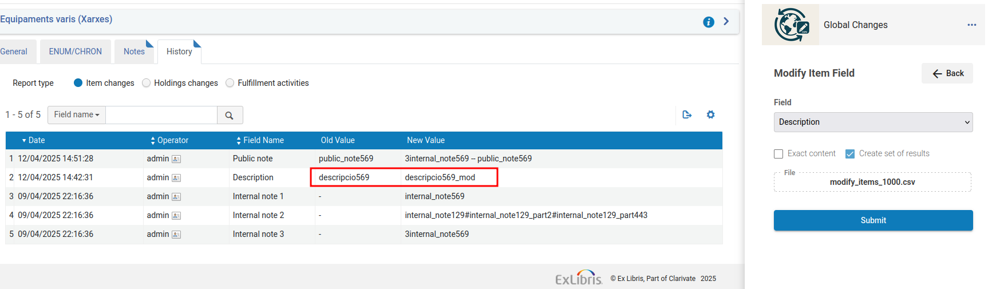

---

### Split Field Functionality (Items)
The CloudApp can split a field into multiple parts using a designated delimiter. In this example, a field containing the hash (`#`) delimiter is split into three parts:
1. The first part is appended to "public note" (using the hash as delimiter).
2. The second part is inserted at the beginning ("front") of "internal note 3" using a point (`.`) as delimiter (with special spacing behavior: a space is added only after this delimiter).
3. The third part overwrites "internal note 2".

**Before Processing – Split Field Example:**

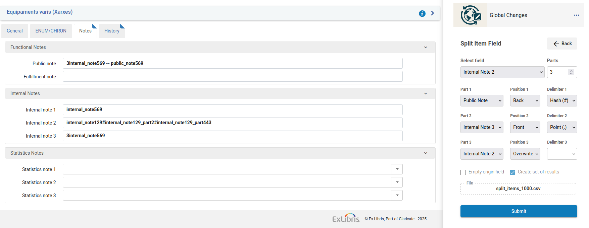

**After Processing – Split Field Result:**

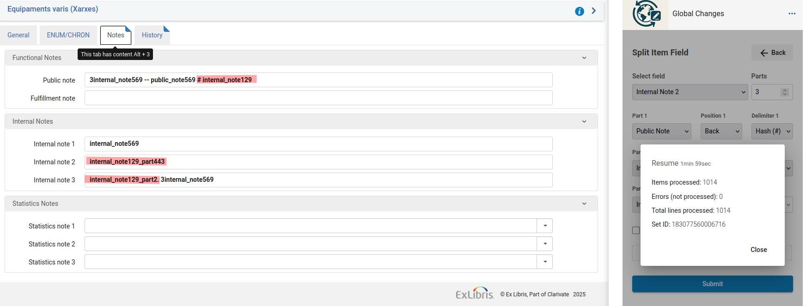

---

### Sets Interface
The CloudApp displays an organized interface for result sets created during processing. All sets are properly identified with the process name and indicate whether they contain successful or failed records.

**Sets Interface:**

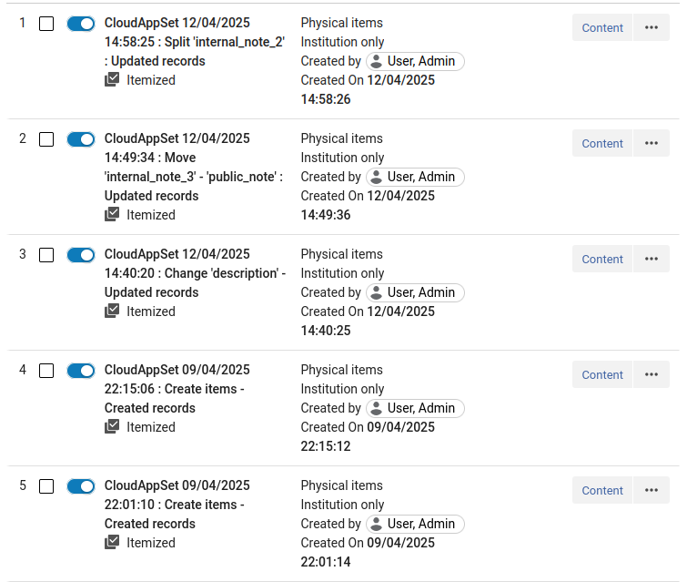

---

This guide is designed to help you navigate the Global Changes CloudApp.

---

