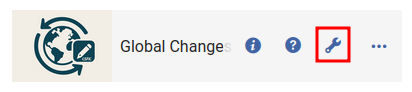
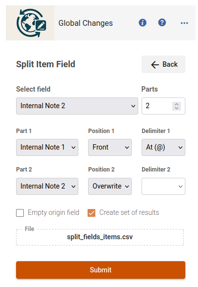

# Global Changes CloudApp Guide

This guide provides an overview of the Global Changes CloudApp, including details on configuration, navigation, and file validation.

---

## 1. Configuration

### Configuration Icon
Access the configuration settings by clicking on the configuration icon within the CloudApp. This icon opens the settings menu where you can define both global and module-specific configurations.

**Configuration Icon:**

---

### Global Configuration
The **Global Configuration** controls access to the entire CloudApp. This section allows administrators to set general access restrictions by specifying which users or roles can use the app.

**Interface:**

---

### Module Configuration
The **Module Configuration** lets you restrict access to specific modules or functionalities within the app. You can define access rules (by user or role) for each module separately.

**Interface:**

---

## 2. Main Application Interface

### Main Interface
Once you enter the CloudApp, you will be greeted with the main interface. This area displays the core functionalities and provides quick access to various features.

**Interface:**

---

### Menu
The **Menu** in the main interface presents all available options. It enables easy navigation between different functionalities such as items, holdings, users, and POLines.

**Menu Interface:**

---

## 3. File Validation

### Validation
All functionalities include different validations, depending on their specific characteristics.

**Validation:**

---

### Validation Error
Before launching a process, the CloudApp validates the uploaded CSV file. If the file fails validation, an error message is displayed. The image below shows an example of a validation error.

**Validation Error:**

---

## 4. Functionality Demonstrations

### Form Interface for Splitting Fields
When you use the function to split fields, a dedicated form appears for entering the required data. The following image shows an example of the interface used for splitting fields.

**Example Form:**

---

This guide is designed to help you navigate the Global Changes CloudApp.

---

